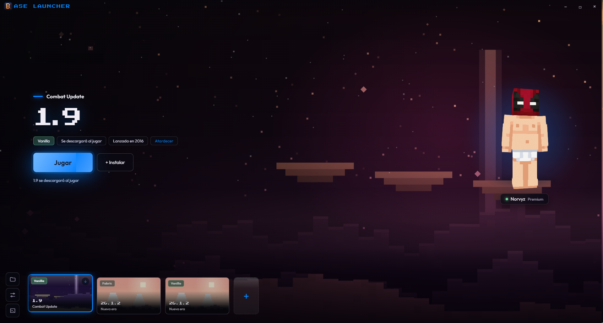
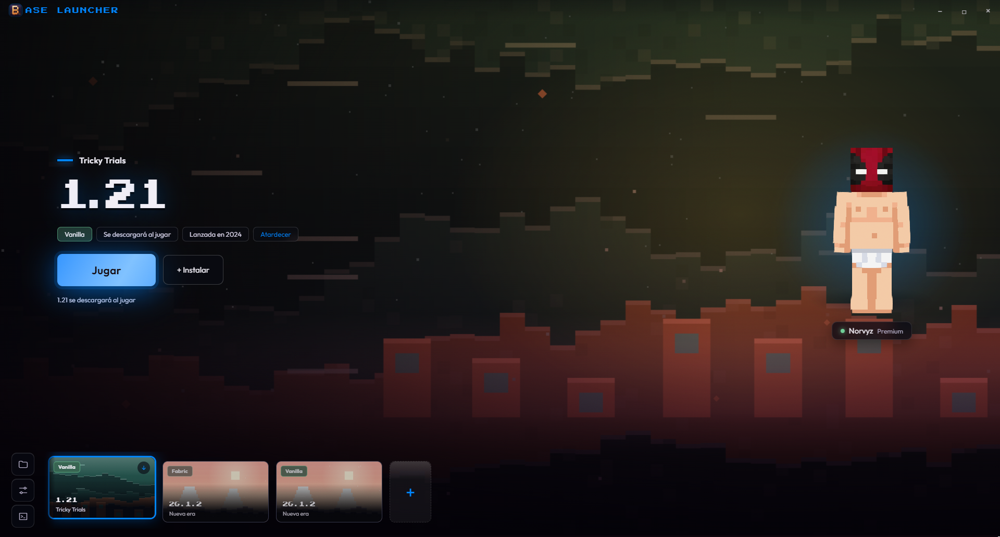
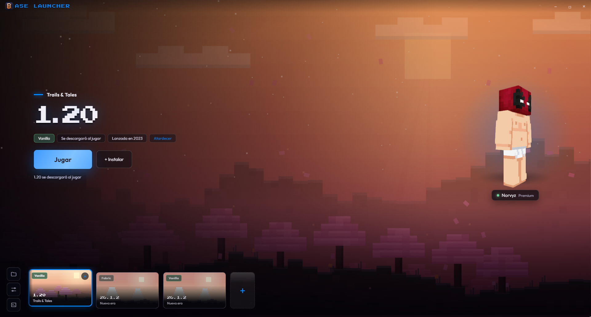
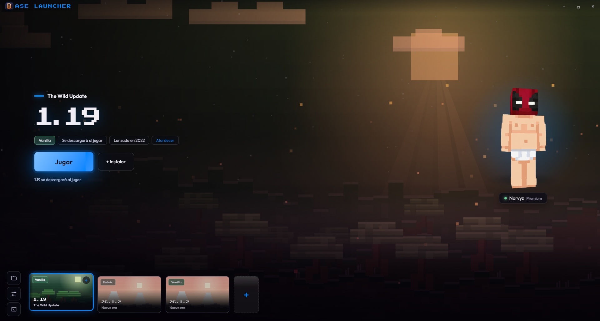
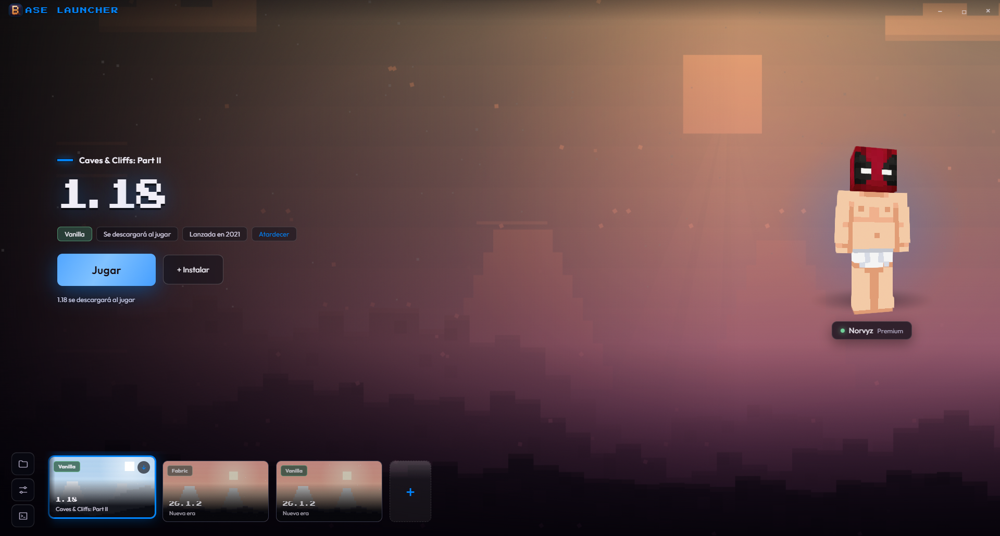
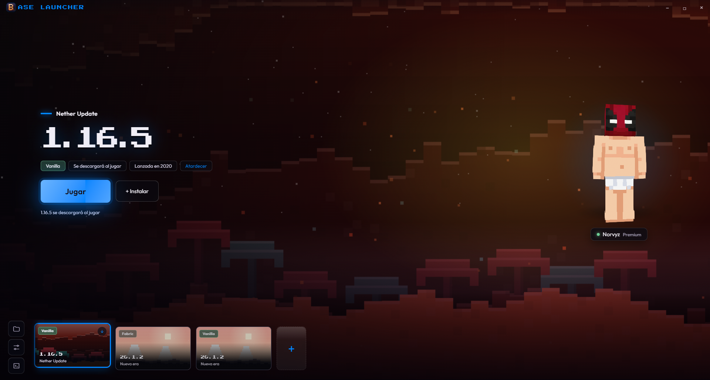
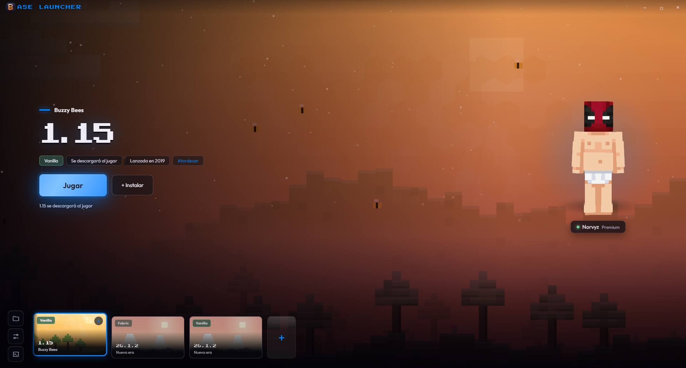
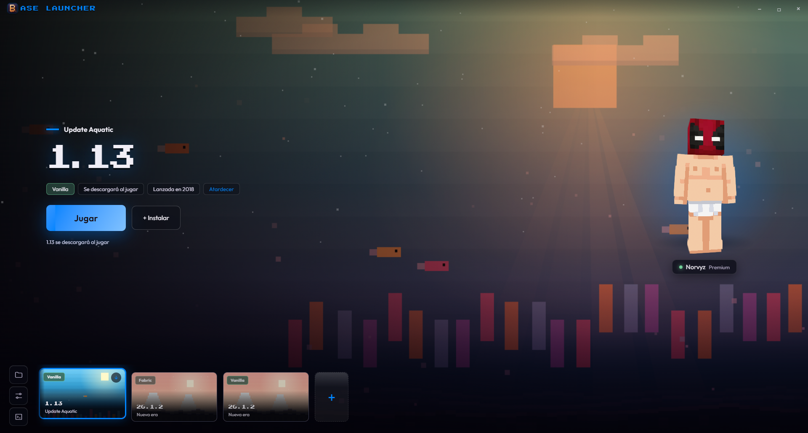

# BaseLauncher

**Sitio web oficial:** [https://baselauncher.site.je/](https://baselauncher.site.je/)

---

## Capturas de pantalla

### Versión 1.21

### Versión 1.20

### Versión 1.19

### Versión 1.18

### Versión 1.16

### Versión 1.15

### Versión 1.13

---

**BaseLauncher** — Tu lanzador personalizado para Minecraft.